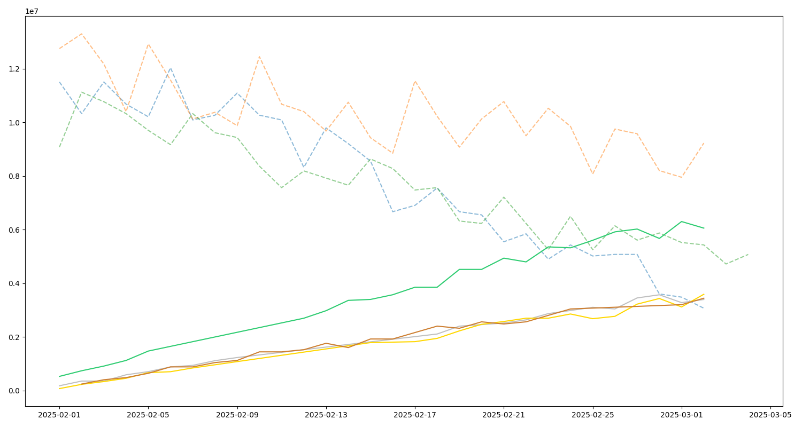
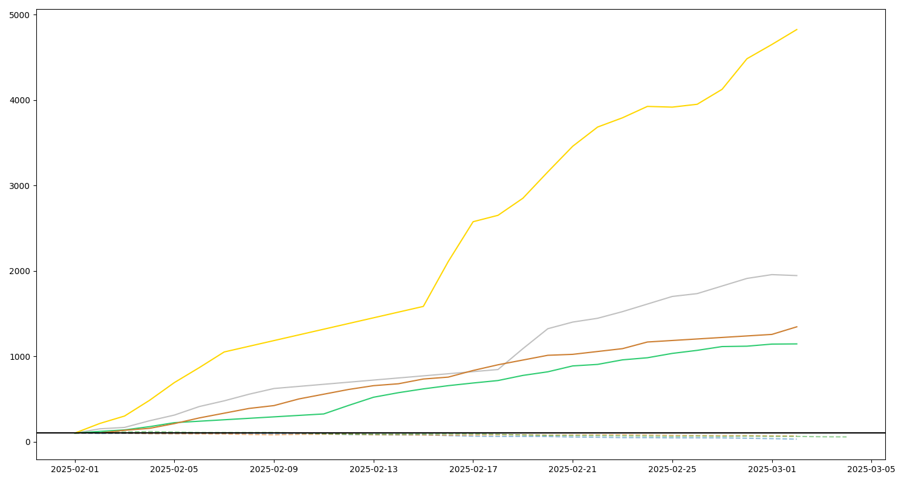

# 🛒 DQLab Retail Crisis and Recovery 🏬

> Uncovering hidden growth opportunities in a declining retail store through data analytics, trend detection, and market basket analysis.

---

## 📌 Background

DQFresh Mart had been watching its total revenue slide for **six consecutive months**. Management's instinct was to double down on proven bestsellers and play it safe. The problem? A handful of smaller products were actually gaining momentum the whole time — they just never showed up prominently in the standard reports.

This project was built to answer three questions:

- Are there products quietly growing that no one is noticing?
- How do customers actually shop — what do they buy together?
- What concrete steps can the store take to turn things around?

---

## 🎯 Objectives

- Identify products with consistently positive sales trends using **Moving Average** analysis
- Flag **"Rising Star"** products based on sustained consecutive growth (≥ 12 days)
- Discover frequently co-purchased product combinations using **Apriori Association Rules**
- Produce visualizations and insights ready for real business decisions

---

## 🗂️ Dataset

Retail transaction records from DQFresh Mart covering **February – March 2025**, containing:

| Field | Description |
|---|---|
| Invoice No. | Unique transaction identifier |
| Date | Transaction date |
| Product Code | Unique product identifier |
| Product Name | Name of the product |
| Quantity | Units sold per transaction |
| Unit Price | Price per unit |
| Total Sales | Total transaction value |

---

## ⚙️ Methodology

### 1. Data Processing
- Aggregated sales by product and date
- Applied **3-day Moving Average** to smooth out daily noise
- Tracked consecutive trend direction over time

### 2. Rising Star Detection
A product earns "Rising Star" status when:
- Its Moving Average increases **continuously**
- That upward trend holds for **at least 12 consecutive days**

### 3. Market Basket Analysis
Association rules mined using the **Apriori algorithm**:
- Minimum support: **1%**
- Lift: **≥ 2**

---

## 📊 Key Findings

### 🌟 Rising Star Products

While the store's top sellers were declining, two products showed consistent upward momentum throughout the observation period:

| Rank | Product | Growth % | Total Sales |
|---|---|---|---|
| 1 | Wajan Enamel Anti Lengket | **452.63%** | Rp 2,800,000 |
| 2 | Sabun Cuci Cair 1.5L | **99.61%** | Rp 6,008,333 |

Meanwhile, the top 3 products by revenue — **Kabel Data Fast Charge**, **Kaos Kaki (3 Pasang)**, and **Teko Listrik** — all showed declining trends over the same period.

### 📈 Visual Output

<p align="center">
  
  <br/>
  <em>Actual Sales Value — Rising Stars vs Top Sellers (Feb–Mar 2025)</em>
</p>

<p align="center">
  
  <br/>
  <em>Relative Growth Index (Base 100) — Rising Stars reached 750–830+ while Top Sellers dropped below 60</em>
</p>

---

### 🛍️ Potential Product Bundles

Using Apriori Association Rules, three bundle opportunities were identified based on frequent co-purchase behavior:

| Bundle | Products | Transactions | Lift |
|---|---|---|---|
| **Everyday Staples** | Kaos Kaki + Sabun Cuci + Minyak Goreng | 185 | 2.26 |
| **Kitchen Must-Haves** | Minyak Goreng + Kaos Kaki + Sabun Cuci Cair | 185 | 2.23 |
| **Home & Clean** | Sabun Cuci Cair + Kaos Kaki + Cairan Pembersih | 103 | 2.11 |

> Lift > 2 means customers are **2x more likely** to buy these together than by chance alone.

---

## 💡 Business Recommendations

1. **Restock Rising Star products proactively** — don't wait until they run out to notice them
2. **Create product bundles** based on association rules and place them in adjacent shelf positions
3. **Redesign the dashboard** — add trend-based visibility so growing products don't go unnoticed
4. **Run targeted promotions** — use basket data to cross-sell at checkout

> *Note: Sabun Cuci Cair appears in nearly every bundle combination, making it not just a Rising Star by growth rate — but also an anchor product in customer purchase behavior.*

---

## 🗃️ Output Files

```
retail_insight.xlsx       ← Full analysis results (Rising Stars + Association Rules)
rising_star_actual.png    ← Actual sales value chart
rising_star_index.png     ← Relative growth index chart
```

---

## 🚀 How to Run

**Clone the repository:**
```bash
git clone https://github.com/your-username/your-repository-name.git
cd your-repository-name
```

**Install dependencies:**
```bash
pip install pandas matplotlib mlxtend openpyxl
```

**Run the script:**
```bash
python solusi-retail.py
```

---

## 🗂️ Project Structure

```
project-folder/
│
├── solusi-retail.py          ← Main analysis script
├── data_penjualan.xlsx       ← Raw transaction data
├── retail_insight.xlsx       ← Output: analysis results
├── rising_star_actual.png    ← Output: actual sales chart
├── rising_star_index.png     ← Output: growth index chart
└── README.md
```

---

## 🛠️ Tech Stack


---

## 🏆 Hackathon

**Event:** DQLab Retail Crisis and Recovery Hackathon

**Case:** Analyzing a retail sales decline and building a data-driven recovery strategy through Python and business analytics.

---

## 👤 Author

**Adrina Firda Marwah**

[](https://www.linkedin.com/in/adrinafirda/)
[](https://github.com/adrinafirda)
